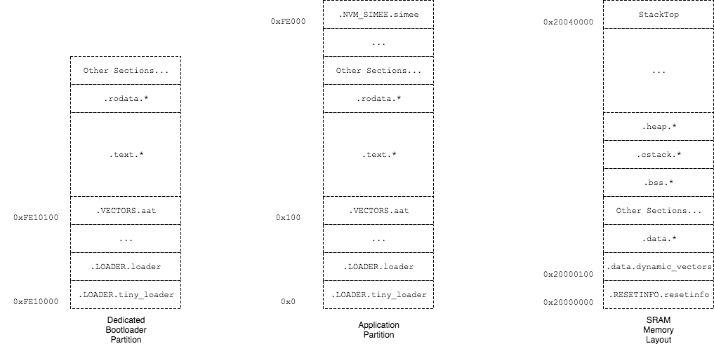

# EFR32 Target
This repository is meant to be included in EFR32 related development project. 

# Note

- 16/Jan/2018: `arm-none-eabi-size` failed to recognize the data section size when RAM function (with
`.ram` attribute) linked. 

# EFR32 Device Memory Map

The detailed memory layout can be found in `scripts/*.ld` folder. Following diagram shows the 
generic application layout that are shared across multiple applications and the bootloader.



Three memory regions can be directly accessed by addresses:
- Dedicated bootloader partition (`0xFE10000-0xFE18000`): On startup the program counter will point to `0xFE10000` if bootloader presents 
and enabled. 
- Application partition (`0x0-0x100000`): Application code.
- SRAM (`0x20000000-0x20040000`): volatile Readable/Writable storage.

Sections:
------------
- `.LOADER`: Load interrupt vector table and branch to the address of second word in vector table.
- `.VECTORS.aat`: Static interrupt vector table and application information. Please refer to
`app_header_block.c.in` and `bl_header_block.c.in` for more information.
- `.text`: Function instructions.
- `.rodata`: Read only data, normally strings and constant variables. 
- `.NVM_SIMEE.simee`: Reserved region for simulated EEPROM region on FLASH memory.
- `.RESETINFO.resetinfo`: The volatile persist region on SRAM. Please refer `README.md` in drivers for more
information.
- `.data.dynamic_vectors`: The configurable interrupt vector table.
- `.data`: The initialized variables.
- `.bss`: The uninitialized variables.
- `.cstack`: Zigbee stack.
- `.heap`: Configurable FreeRTOS heap.
- `StackTop`: The base address of main stack pointer. 

# The Definitive Guide to Driver Development

0. Welcome to Embedded World
    - Anything can go wrong.
    - Nothing is reliable, especially the clock and *printf*.
    - Check your stack pointer if a random function is called without the parent. When stack pointer is not properly configured, 
    every lines of code is unreliable. 
        ```gdb
        print/x $sp
        ```
    - Check your clock configuration if *printf* gives random unreadable characters. 
    - *HardFault* makes life easier. Consult *The Definitive Guide to ARM® CORTEX®-M3 and CORTEX®-M4 Processors* for 
     debugging *HardFault* error.
    - *UsageFault* need to be enabled otherwise *HardFault* is called. *UsageFault* is normally caused by division
    by zero, or *BLX* instruction, or even unaligned memory fetch. 
        ```asm
        blx r0
        ```
        In this case, if LSB of *R0* is not set, *UsageFault* will be called to indicating the processor is trying
        to switch from Thumb mode to ARM mode. (ARM mode is not fully supported by Cortex M4 processors)
    - In recent release of the driver the fault can be handled by generic fault handler. Error registers, as well as 
    generic purpose registers, will be dumped to `.RESETINFO` region before restart. 
   

1. Always comment your code
    - You don't need to comment every line of code you wrote, the code can explain itself.
    - Doxygen style is advised
        - Includes header block
            ```C
            target.c
            --------
            
            /**
             * @file target.c
             * @brief Placeholder for building target library
             * @author Ran Bao (ran.bao@wirelessguard.co.nz)
             * @date March, 2017
             *
             * This file is intentionally left blank unless specific feature
             * is required to be implemented
             */
             ```
        - Include function description
            ```C
            /**
             * @brief Initialize I2C driver
             * @param obj I2C instance
             * @param sda sda pin
             * @param scl scl pin
             * @param enable enable pin
             */
            void i2cdrv_init(i2cdrv_t *obj, pio_t sda, pio_t scl, pio_t enable);
            ```
        - Doxygen is generated on build server, you can still preview it locallly by installing doxygen on your computer.

2. One module one folder
    - The module is composed with at least one API header and one implementation file. 
    - You will become a lovely person if you could provide clear and friendly API, as well as documentation and examples to other developers.
    - Provide correct build script. Following code provides an basic CMakeLists.txt for the module.
        ```cmake
        MESSAGE("ENTER ${CMAKE_CURRENT_SOURCE_DIR}")
        
        # get module name
        GET_FILENAME_COMPONENT(LIB_NAME ${CMAKE_CURRENT_SOURCE_DIR} NAME)
        
        # Collect all source file
        FILE (GLOB SRC *.c)
        
        # build library
        ADD_LIBRARY (${LIB_NAME} ${SRC})
        ```
    - Additional dependency with other peripherals and modules can be appended as follow:
        ```cmake 
        # add dependency and build order
        ADD_DEPENDENCIES(${LIB_NAME} emlib emdrv)
        TARGET_LINK_LIBRARIES(${LIB_NAME} emlib emdrv)
        ```
        Note: ```ADD_DEPENDENCY()``` will call to build other module first. ```TARGET_LINK_LIBRARIES()```, on the other hand, 
        will specific the link order when resolving unknown symbols. 
    - You can build your module individually by make tools
        ```bash 
        $ make name_of_your_module
        ```
        
3. **Use assertion in development**
    - ```drv_debug.h``` provides friendly tool for performing sanity checks in the runtime. Following snippet shows an example 
    of the use of assert in development:
        ```C
        /**
         * @brief Initialize stack structure
         * @param stack pointer to the stack
         * @param size the maximum number of item stored in stack
         */
        void stack32_init(stack_t *stack, size_t size)
        {
        	DRV_ASSERT(stack);
        
        	// dynamically allocate memory for the stack
        	stack->array = malloc(sizeof(uint32_t) * size);
        
        	DRV_ASSERT(stack->array);
        
        	// initialize stack pointer
        	stack->stack_pointer = 0;
        
        	stack->size = size;
        }
        ``` 
        As shown in example above, ```DRV_ASSERT(expression);``` is the macro for placing assertion symbols in the code. The code will
        stop running when expression is evaluate to false. 
    - There is no overhead for placing assertion symbols in the code. The assertion symbols can be easily removed
    in the production code. 
    
4. Think in the Object Oriented(OO) way
    - The concept of OO includes encapsulation, inheritance and polymorphism.
    - Everything can be abstracted as an object, especially peripherals and devices. 
    - Each object has its own memory and methods. 
    - In C we implement OO objects with structure and pointers. 
    - Following example shows how I2C can be treated as an object:
        ```C
        typedef struct
        {
        	bool initialized;
        	I2C_TypeDef * base;
        
        	pio_t sda;
        	pio_t scl;
        	pio_t enable;
        
        } i2cdrv_t;
        ```
    - The I2C object implements several member functions, for example:
        ```C
        /**
         * @brief Initialize I2C driver
         * @param obj I2C instance
         * @param sda sda pin
         * @param scl scl pin
         * @param enable enable pin
         */
        void i2cdrv_init(i2cdrv_t *obj, pio_t sda, pio_t scl, pio_t enable);
        ```
        The member function takes the pointer to the object as the first arguments, followed by other
        other optional arguments.
    - The object can be encapsulated by other modules, for example, the EEPROM driver:
        ```C
        typedef struct
        {
        	i2cdrv_t * i2c_device;
        	pio_t enable;
        	bool initialized;
        } eeprom_cat24c16_t;
        ```
        Other modules have easy way of accessing I2C driver and its properties. Following example shows 
        how EEPROM invokes I2C member function for reading data from I2C slave devices
        ```C
        void eeprom_cat24c16_page_write(eeprom_cat24c16_t * obj, uint16_t location, void * buffer)
        {
        	I2C_TransferReturn_TypeDef ret;
        
        	// get corresponding slave address and internal address from location information
        	uint8_t slave_addr = 0;
        	uint8_t internal_addr = 0;
        	eeprom_cat24c16_get_address_pri(location, &slave_addr, &internal_addr);

        	// perform a page write sequence operation
        	eeprom_cat24c16_enable_pri(obj);
        
        	// poll the eeprom until chip is ready
        	eeprom_cat24c16_ack_polling_pri(obj, slave_addr);
        
        	// start transferring data
        	ret = i2cdrv_master_write_iaddr(obj->i2c_device, slave_addr, internal_addr, buffer, EEPROM_CAT24C16_BLOCK_SIZE);
        
        	// poll the eeprom until chip is ready (allow data to be written into the memory)
        	eeprom_cat24c16_ack_polling_pri(obj, slave_addr);
        
        	// transfer complete
        	eeprom_cat24c16_disable_pri(obj);
        
        	DRV_ASSERT(ret == i2cTransferDone);
        }
        ```

5. Use static memory
    - We cannot guarantee the memory can be allocated at runtime, so allocate your memory statically.
    - Dynamic memory makes the embedded system unpredictable. 
    - Unpredictable means the developers can not analyse the performance of code and memory comsumption statically without loading
    binary to the device. 

