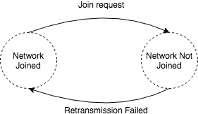
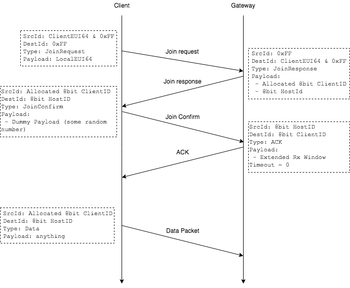
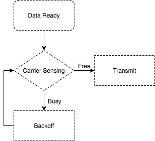
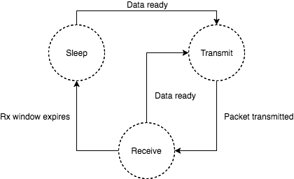
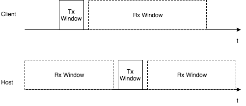

# WG_MAC Wireless Protocol -- Client implementation

`wg_mac` module contains client side implementation of simple MAC protocol that has been
used to report sensor data from Hatch to the gateway. 

Following section briefly described how such protocol is implemented. Please refer to 
source code for more specific information.

Network state
--------------------
The network host (normally being referred as the gateway) keeps the state, as well as the device 
identity (EUI64). Each client can only report data to one specific host at a time. This is achieved
by broadcasting a `JoinRequest` packet to the network. The gateway, which responses to such join request
first, becomes the host of such client. The diagram below shows the bi-state of the client in the network.

Join Request
-------------
In order to minimize globally unique EUI64 being transmitted unencrypted [^1] on the network, 
and reduce the possible overhead, short 8bit EUI64, which will be locally unique to the host network, 
is generated by the host and assigned to the client. 

The operation of join process can be summarized in the following diagram. The host stores all information about
the client while the client only knows host's short ID.

Uplink and Downlink
--------------
The uplink message can be transmitted at any time. To avoid (minimize) the chance of packet collision, 
carrier sensing [^2] should be applied before transmitting. 

After packet being transmitted successfully, the client will open the receive window for certain amount of time
before entering the sleep state. Any downlink message should be issued during clients' receive window. 

The receive window for a client device is a fixed period right after the previous transmission. The Rx window
can be interrupted when further transmission is required.

Notes
-----
[^1]: Encryption will be focused in the next release of protocol. 

[^2]: Carrier Sensing and CSMA backoff scheme will be addressed in the network release of the protocol.
