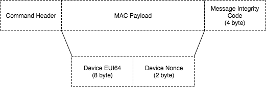

# WG_MAC Wireless Protocol -- Client implementation

`wg_mac` module contains client side implementation of simple MAC protocol that has been
used to report sensor data from Hatch to the gateway. 

Following sections briefly describes how is implemented. Please refer to 
source code for more specific information.

Network States
--------------------
The network host (normally being referred as the gateway) keeps the state, as well as the device 
identity (EUI64). Each client can only report data to one specific host at a time. This is achieved
by broadcasting a `JoinRequest` packet to the network. The gateway, which responses to such join request
first, becomes the host of such client. The diagram below shows the bi-state of the client in the network.

Join Request
-------------
In order to minimize globally unique EUI64 being transmitted unencrypted [^1] on the network, 
and reduce the possible overhead, short 8bit EUI64, which will be locally unique to the host network, 
is generated by the host and assigned to the client. 

The operation of join process can be summarized in the following diagram. The host stores all information about
the client while the client only knows host's short ID.

Uplink and Downlink Channel
--------------
The uplink message can be transmitted at any time. To avoid (minimize) the chance of packet collision, 
carrier sensing [^2] should be applied before transmitting. 

After packet being transmitted successfully, the client will open the receive window for certain amount of time
before entering the sleep state. Any downlink message should be issued during clients' receive window. 

The receive window for a client device is a fixed period right after the previous transmission. The Rx window
can be interrupted when further transmission is required.

Configurable Downlink Window
-----------------
To make sure downlink message can be reliably delivered, the host can request the client to open the receive window 
longer than it should be. The receive window should be large enough for host to perform at least one retransmission. 

Currently the configurable receive window information is encapsulated in downlink acknowledgement packet. The client 
will then reconfigure the receive window immediately. The receive window will be kept open until expires. The following 
timing diagram shows how downlink window can be configured. 

Encryption
----------
The encryption of `wg_mac` protocol is described in this section:

- **Join Request**

    The `Join Request`packet is transmitted by client on startup before sending any other packet. The MAC payload includes 
    globally unique EUI64 that is written to the hardware, and a randomly generated 2 byte device nonce. Those data, 
    combing information provided by the host, will be used to generate network session key in the upcoming data
    exchange. Message Integrity Code (MIC) is generated by client accordingly to ensure the MAC payload is valid.  
    
    

- **Join Response**
    
    The `Join Response` is generated and transmitted by the host (likely NCP) in response to `Join Request` initiated 
    by the client. The `Join Reponse` provides necessary information for generating network session key, which will be used
    in the on going data transfer. The following diagram shows the packet structure of the `Join Response` message. It is noticed
    that the MAC payload is encrypted. The information stored at the client side should be able to decode the message. 
    
    

Notes
-----
[^1]: Encryption will be focused in the next release of protocol. 

[^2]: Carrier Sensing and CSMA backoff scheme will be addressed in the network release of the protocol.
