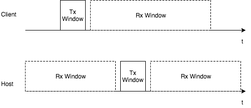

# WG_MAC Wireless Protocol -- NCP implementation

`wg_mac_ncp` module contains the implementation of simple MAC protocol as a data sink, which relays
sensor data from Hatch to cloud. 

Following sections briefly describes how protocol is designed and implemented. Please refer to source
code for more specific information.

Transceiver States
-------------
Unlike Hatch, the network co-processor have access to wall power. The transceiver only toggles between two
states, either transmit or receive. 

The network co-processor will enter receive state on startup, or right after the successful transmission. 
The receive state can be interrupted by either user and the network stack. The timing window can be found below:

Bookkeeping
-----------
The network co-processor maintains a list of clients information. It handles the join request from new client/repeated
client. To reduce the overhead and avoid possible security issue, the network co-processor will generate a locally unique
id for newly joined devices as identities. Following diagram shows how clients are handled when `JoinRequest` packet is
received. 

The bookkeeping thread is executed periodically to validate the state of clients. For any client that failed to 
send acknowledgement, the network co-processor will attempt to retransmit. The client will be removed from list
if either no response or haven't seen for a long time (those thresholds are configurable). 

Downlink Channel
----------------
Due to the fact that clients only open receive window for a certain mount of time, downlink message need to be queued 
and waiting for uplink message from that specific client. 

Each client will queue up to one downlink packet. Any new downlink packet to the same client will overwrite the old one
if the old packet doesn't have a chance to transmit. 

The downlink message will be activated and transmited right after the acknowledgement packet has been transmitted. Only
the data packet will guarantee the downlink slot will be opened. The downlink packet transmission operation can be described 
by a state machine. The state transiton diagram is shown below:

To grant more time for host to transmit data, including the retransmission, the host can request the client to extend
its receive window by specifying such timeout in the acknowledgement packet. As it is shown in diagram below, the client
will maintain its receive window until expires.

Encryption
----------
